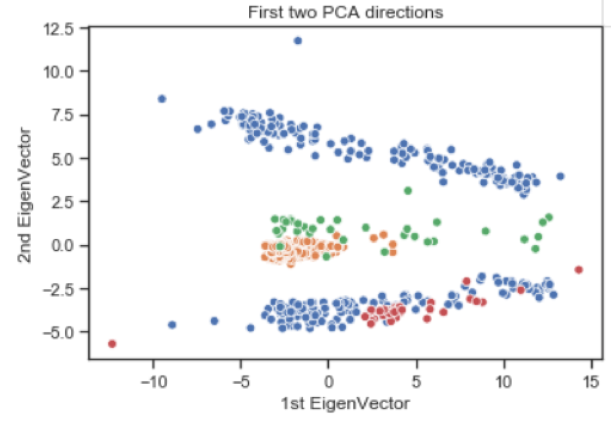
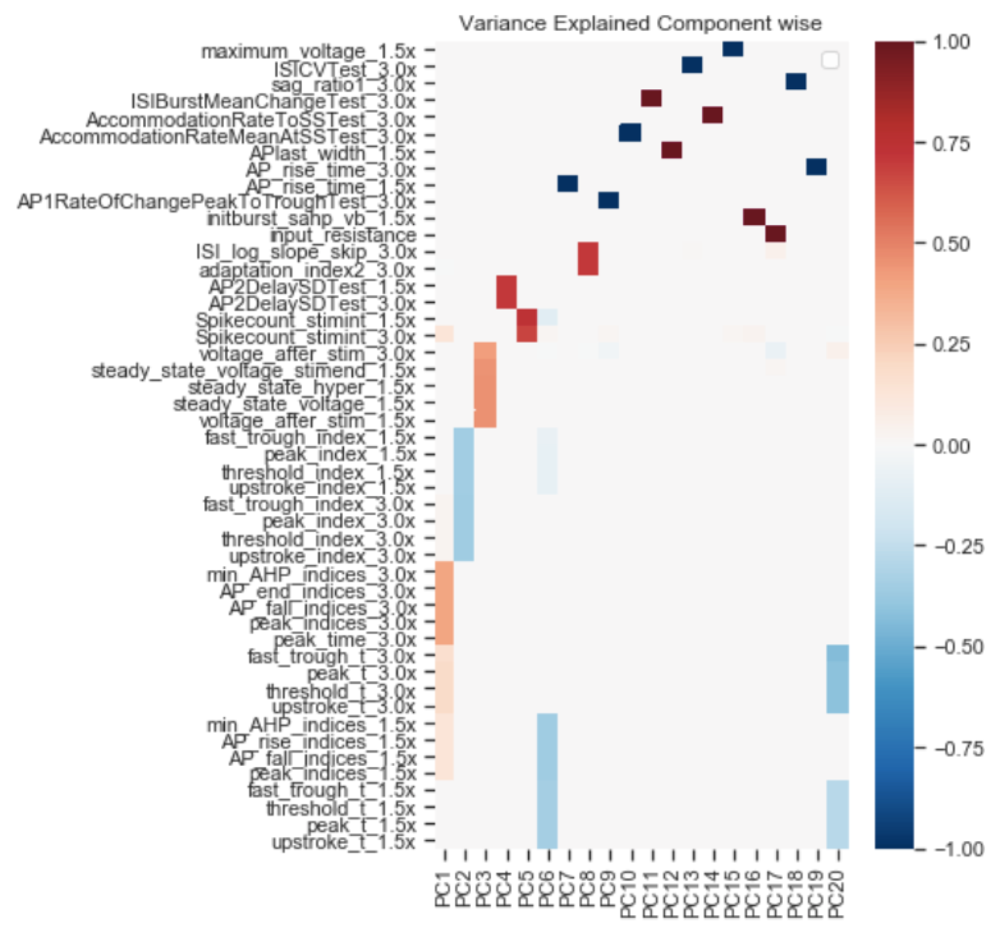

## Header row {data-height=15}

###

<table style="width:100%">
<tr>
  <td><center><h3>
  **LARGE SCALE DISCRIMINATION BETWEEN NEURAL MODELS AND EXPERIMENTAL DATA**
  </h3></center></td>
  <td rowspan="2">
  </img>
  </td>
</tr>
<tr><td><center>
  Russell Jarvis, Professor Rick Gerkin, Professor Sharon M Crook
  </center></td>
</tr>
</table> 

<hr>


**Abstract** 
NeuroML-DB [2] catalogues over 1,500 published models obtained in NeuroML format from Open Source Brain [5]. Complementing OSB, NeuroML-DB provides systematic characterizations of model complexity,  electrophysiology, and morphology, making it easy to find, evaluate, and reuse models and their components


## Body row {data-height=115}

### **MODELING METHODS**
**Publications Associated with Model Sources:**

|Large Scale Model|Blue Brain Project (1035)|Gouwens et al (2018) [6]|
|---|---|---|
Publication|Markram et al (2015) [8]| Gouwens et al (2018) [6]|
**Feature Sources: **

|Feature1|Feature2|Feature3|
|---|---|---|
|Ephys Feature Extraction Library | allensdk.ephys.ephys_features | Druckmann et al. (2012) [3] |


**Virtual Experiment Three Step Protocol Stimulate for 2s**

|Injection 1 |Injection 2|Injection 3|  
|---|---|---|
| at 1.0×Rheobase | at 1.5×Rheobase  | at 3.0×Rheobase  |   


### Example Features
We unified three different feature extraction protocols to create a very high 
dimensional feature space.

To compile this poster do:
```
in R install library: postr
BASH terminal Run:
R -e "rmarkdown::render('CNS_poster_2020.Rmd',output_file='CNS_poster_2020.html')"
Or use knit inside R-studio
```

```{r setup, include=FALSE}
library(reticulate)
use_python("/anaconda3/bin/python")
```


### **Dimensionality Reduction**




```
import pickle
import pandas as pd
```

### **EigenValue Component Loadings**



## Footer row {data-height=10} 

### {data-width=50}
Interactive Plots:
[dimension_reduced_TSNE](dimension_reduced_TSNE.html)


### {data-width=50 .small}


