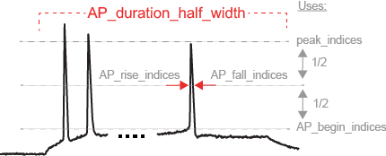

```{r setup, include=FALSE}
knitr::opts_chunk$set(echo = FALSE)
```

# Introduction

Welcome to `posterdown` ! This is my attempt to provide a semi-smooth workflow for those who wish to take their R Markdown skills to the conference world. Most features from R Markdown are available in this package such as Markdown section notation, figure captioning, and even citations like this one [@R-rmarkdown]. The rest of this example poster will show how you can insert typical conference poster features into your own document. 

## Objectives

1. Easy to use reproducible poster design. 
2. Integration with R Markdown.
3. Easy transition from `posterdown` to `pagedown` report or manuscript documents [@R-pagedown].

### **MODELING METHODS**
**Publications Associated with Model Sources:**

|Large Scale Model|Blue Brain Project (1035)|Gouwens et al (2018) [6]|
|---|---|---|
Publication|Markram et al (2015) [8]| Gouwens et al (2018) [6]|
**Feature Sources: **

|Feature1|Feature2|Feature3|
|---|---|---|
|Ephys Feature Extraction Library | allensdk.ephys.ephys_features | Druckmann et al. (2012) [3] |


**Virtual Experiment Three Step Protocol Stimulate for 2s**

|Injection 1 |Injection 2|Injection 3|  
|---|---|---|
| at 1.0×Rheobase | at 1.5×Rheobase  | at 3.0×Rheobase  |  

# Results

Usually you want to have a nice table displaying some important results that you have calculated. In `posterdown` this is as easy as using the `kable` table formatting you are probably use to as per typical R Markdown formatting.


<iframe
  src="dimension_reduced_TSNE.html"
  style="width:100%; height:800px;"
></iframe>
<div>
</img>
</div>

# Next Steps

Aliquam sed faucibus risus, quis efficitur erat. Vestibulum semper mauris quis tempus eleifend. Aliquam sagittis dictum ipsum, quis viverra ligula eleifend ut. Curabitur sagittis vitae arcu eget faucibus. In non elementum felis. Duis et aliquam nunc. Nunc pulvinar sapien nunc, vel pretium nisi efficitur in. Fusce fringilla maximus leo et maximus. Fusce at ligula laoreet, iaculis mi at, auctor odio. Praesent sed elementum justo. Aenean consectetur risus rhoncus tincidunt efficitur. Praesent dictum mauris at diam maximus maximus [@R-posterdown].

# Conclusion
Try `posterdown` out! Hopefully you like it!

```{r, include=FALSE}
knitr::write_bib(c('knitr','rmarkdown','posterdown','pagedown'), 'packages.bib')
```

# References